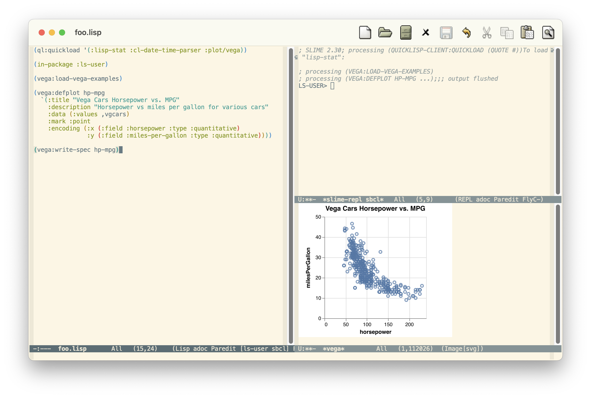

[](https://melpa.org/#/vega-view)

# emacs-vega-view

This is a small library meant to facilitate exploratory data
visualization using [Vega](https://vega.github.io/vega/) from within
emacs.

## Installation

In order to use this package, you must have the Vega command line
tools on your path. The easiest way to arrange that is to install the
latest version with using `npm`:

```sh
npm install -g vega vega-lite vega-cli
```

If you need PNG support (for example, if your `emacs` hasn't been
compiled with support for SVG rendering), you will also need to
install the `canvas` package:

```sh
npm install -g canvas
```

## Configuration

By default this library produces SVG output when used from an emacs
that supports SVG. If you would prefer that it produce PNG -- for
example, if your emacs has trouble displaying SVGs or the drawings you
are producing would be very, very large as SVG (tens of thousands of
embedded data points) -- you can set the var `vega-view-prefer-png` to
any truth-y value to prefer PNGs:

``` emacs-lisp
(setq vega-view-prefer-png t)
```

In addition, `view-vega` defaults to using the current working
directory of the buffer in which it is invoked. One can override by
setting the var `vega-view-base-directory` to a specific
directory. This can be useful if your specification refers to static
assets using a relative path. Setting `vega-view-base-directory` back
to a false-y value will return the default behavior.

## Usage

Vega-view currently supports a single interactive function,
`vega-view`, that can be invoked within a top-level form to visualize
it as a Vega plot. Currently, three kinds of Vega notation are
supported:

* `JSON`, which is passed directly to Vega. Common Lisp is also
  supported by generating the JSON to send directly to Vega.
* `elisp`, which is evaluated and converted to `JSON` before being
  passed to Vega. The `elisp` Vega specification format is, not
  coincidentally, the same as what is produced by called `read-json`
  on any Vega `JSON` specification.
* `clojure`, which is evaluated in the buffer's current
  [cider](https://github.com/clojure-emacs/cider) context and
  converted to `JSON` before being passed to Vega. The `clojure`
  specification format is whatever `EDN` would translate into the
  `JSON` specification you want. This is, also not coincidentally, the
  same format one would use with
  [Oz](https://github.com/metasoarous/oz).

When `vega-view` is invoked it first identifies the preceding `sexp`
(whatever that means for the language of the buffer), performs the
mode-specific conversion described above, then pipes it through the
Vega command line tools to convert the specification to an `SVG`
drawing. The drawing -- or the errors produced by Vega while trying to
produce it -- are then displayed in an `image-mode` buffer called
`*vega*`. (Note that you can toggle between viewing an `SVG` image in
an `image-mode` buffer as image or text using `C-c C-c` in that
buffer.)

### `JSON`

Suppose you have a `json-mode` buffer containing this Vega specification:

``` json
{
    "data": {
        "values": [
            {"a": "A", "b": 28}, {"a": "B", "b": 55}, {"a": "C", "b": 43},
            {"a": "D", "b": 91}, {"a": "E", "b": 81}, {"a": "F", "b": 53},
            {"a": "G", "b": 19}, {"a": "H", "b": 87}, {"a": "I", "b": 52}
        ]
    },
    "mark": "bar",
    "encoding": {
        "x": {"field": "a", "type": "ordinal", "axis": {"labelAngle": 0}},
        "y": {"field": "b", "type": "quantitative"}
    }
}
```

Placing the cursor after the final `}` and invoking `vega-view` will
bring up a new window (in the emacs sense of the term) containing an
SVG drawing made from this spec.


### `elisp`

The code sample below was produced by invoking `pp-eval-last-sexp`
after `(json-read-file "sample.json")` in the `*scratch*` buffer. The
contents of `sample.json` are the same as in the `JSON` example above.

If we place the cursor after the final parenthesis of this `elisp`
form, it will show the same drawing that was generated above.

``` emacs-lisp
'(($schema . "https://vega.github.io/schema/vega-lite/v4.json")
  (description . "A simple bar chart with embedded data.")
  (data
   (values . [((a . "A") (b . 28)) ((a . "B") (b . 55))
              ((a . "C") (b . 43)) ((a . "D") (b . 91))
              ((a . "E") (b . 81)) ((a . "F") (b . 53))
              ((a . "G") (b . 19)) ((a . "H") (b . 87))
              ((a . "I") (b . 52))]))
  (mark . "bar")
  (encoding
   (x (field . "a")
      (type . "ordinal")
      (axis (labelAngle . 0)))
   (y (field . "b")
      (type . "quantitative"))))
```

Note that, because the `elisp` code is evaluated before being sent to
Vega, one can produce programmatic graphs easily using only
`elisp`. For example, this code will thread in the contents of a JSON
data file to another example specification to plot the chart that
follows:

``` emacs-lisp
`(($schema . "https://vega.github.io/schema/vega-lite/v4.json")
  (data
   (values . ,(json-read-file "/Users/jack/src/emacs-vega/data/movies.json")))
  (transform . [((filter (and . [((field . "IMDB_Rating")
                                  (valid . t))
                                 ((field . "Rotten_Tomatoes_Rating")
                                  (valid . t))])))])
  (mark . "rect")
  (width . 800)
  (height . 600)
  (encoding
   (x (bin (maxbins . 60))
      (field . "IMDB_Rating")
      (type . "quantitative"))
   (y (bin (maxbins . 40))
      (field . "Rotten_Tomatoes_Rating")
      (type . "quantitative"))
   (color (aggregate . "count")
          (type . "quantitative")))
  (config (view (stroke . "transparent"))))
```


### `clojure`

Just as in the case of `elisp`, one can write whatever `clojure` code
they prefer and see the result of evaluating it and passing it through
Vega (note that cider must be active!). For example, this form will
plot twenty random values as a line chart:

``` clojure
{:data {:values (map hash-map
                     (repeat :a)
                     (range 1 20)
                     (repeat :b)
                     (repeatedly #(* 100 (Math/random))))}
   :mark "line",
   :width 800
   :height 600
   :encoding {:x {:field :a, :type "ordinal", :axis {"labelAngle" 0}},
              :y {:field :b, :type "quantitative"}}}
```


### Common Lisp
The Common Lisp library [Lisp-Stat](https://github.com/Lisp-Stat)'s
[plot](https://github.com/Lisp-Stat/plot) library supports generating
Vega-Lite specifications from its data-frame data type. Similar to the
Clojure support, invoking `vega-view` on a variable or expression that
returns a JSON Vega-Lite spec in either a `slime-repl-mode` or
`lisp-mode` buffer will evaluate it in the current REPL context and
pass the string to the `vega-view` processing for `JSON`.



## TODO

The `vega-view` function should be split into two functions, one that
produces a drawing in a similar manner to `eval-preceding-sexp` (as
the current function does) and one that works like `eval-defun`
(converting the top level `sexp`).

Likewise, there should be an easy way to select between Vega-lite and
full Vega. Perhaps by checking for the presence of a full Vega schema
declaration?

We currently `(set! *print-length* nil)` in the `cider` handler to
avoid truncation of the return value from the user's clojure
REPL. This is rude, and we should find a better way.
